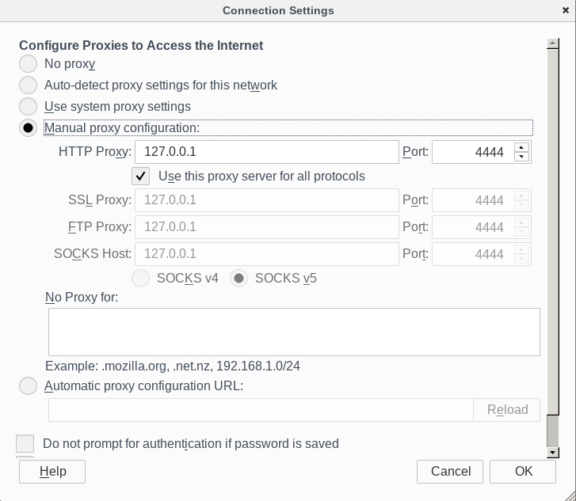

# i2p-browser-for-cheaters

The path of least resistance to a Linux-only i2p browser. A script that Modifies
a tor browser bundle and spits out a tar.gz.

All it does it take the standard Tor Browser Bundle, applies custom settings to
torlauncher, torbutton, and HTTPS everywhere(I've disabled the observatory and
automatic updates for now,for now, until I learn more about HTTPS everywhere
rulesets and how they work/[worked](https://github.com/chris-barry/darkweb-everywhere)
with i2p).

By the way, these notes are, at this point, as much for my benefit as anybody
else's. Need to keep track of what's going on.

## Details:

The bulk of the work is being done by [this script shell script now](https://github.com/eyedeekay/i2p-browser-for-cheaters/blob/master/setup-i2p-browser.sh).
If you just want to modify a TBB to work with i2p, you can:

        ./setup-i2p-browser.sh "$path_to_browser" "$desired_port" "$desired_addr"

Here is, in some detail, what it does:

First it adds a few lines to the TBB's [extension-overrides.js](https://github.com/eyedeekay/i2p-browser-for-cheaters/raw/master/extension-overrides.js)
so that it keeps torlauncher from starting tor, tells it not to try and use
bridges, and configures it to not pop up a menu. It also tells torbutton to not
unset our custom proxy settings and attempt to use Tor, and tells HTTPS
Everywhere to not try and use resources on the clearnet.

### HTTPS Everywhere settings

        pref("extensions.https_everywhere._observatory.enabled", false);
        pref("extensions.https_everywhere._options.autoUpdateRulesets", false);

### TorButton settings

        pref("extensions.torbutton.use_nontor_proxy", true);

[source](https://gitweb.torproject.org/torbutton.git/tree/src/defaults/preferences/preferences.js)

### TorLauncher settings

        pref("extensions.torlauncher.start_tor", false);
        pref("extensions.torlauncher.default_bridge_type", "");
        pref("extensions.torlauncher.prompt_at_startup", false);

[source](https://gitweb.torproject.org/tor-launcher.git/tree/src/defaults/preferences/prefs.js)

After applying the extension modifications, it applies the i2p http proxy
settings. In particular, it points the http proxy at 127.0.0.1:4444, it sets the
http proxy to be used for all connections, and it removes all exceptions for
un-proxied connections. That's all put into a file called [i2p-browser.js](https://github.com/eyedeekay/i2p-browser-for-cheaters/raw/master/i2p-browser.js).

        pref("network.proxy.no_proxies_on", 0);
        pref("network.proxy.type", 1);
        pref("network.proxy.http", "127.0.0.1");
        pref("network.proxy.http_port", 4444);
        pref("network.proxy.share_proxy_settings", true);

Then it renames a few files from something like start-tor-browser to
start-i2p-browser.

#### Script+make(for now, because sometimes everything looks like a nail and no where is that more true than for Docker users)

When used with the Makefile, the script can be used to build some semi-standard
variants of the browser. I did this to deliberately separate the process of
getting the TBB from modifying it to work with i2p, and to automate the process
of downloading, checking, and unpacking a stable TBB for use with the script.
The Makefile scrapes the TBB download page to find the latest stable TBB version
(*note to self, make language configurable*) and exports it to the make command.
Then it downloads the stable TBB, checks the signature, and unpacks it. That
process is done with the "download" make target.

        make download

If you also want to automatically apply the script to your fresh TBB, you can
do

        make easy

instead.

From there, it can be run from the directory ./browser/tor-browser_en-US/.

##### Script+make+Docker(Variants and package management)

Originally, this process was achieved via a Dockerfile, but a Dockerfile is
basically just a script with benefits so the essentials were moved out to the
./setup-i2p-browser.sh script, and now the Dockerfile is being used for it's
more substantial benefits. Building it with make+Docker can produce tarballs
and deb packages for 3 variants. **IF you use these, please be aware that**
**they will fail tests of reproducibility against the regular TBB.** That
includes the .deb's I've got over on the [Releases Page](https://github.com/eyedeekay/i2p-browser-for-cheaters/releases).

There are three packagable variants that have this serious shortcoming. If you
want to use your package manager to track the files and directories used by the
resultant modified bundle but trust your computer more than mine, then the
first variant is probably what you want. It points the proxy to 127.0.0.1:4444.
To generate the tarball and the deb, run

        make cheater

There's also a version which points to port 8118, a the default port used by
privoxy, in order to make a package for people who use Privoxy to route traffic
to multiple anonymous overlay networks. To build and package this variant, run

        make privoxy

Finally, there's a variant which I use with my experimental out-of-router http
proxy. Probably nobody needs this one, but to build it, run

        make di

For all variants, if you use the deb package, the application will be installed
and run by it's own user and a script will be placed into /usr/bin to launch it.
These scripts are in the ./bin directory.  if you export a SIGNING_KEY variable
before running make, then the checksum will also be signed at the final step.
Each variant can also be run in the Docker container if run with the --net host
option or by networking them with a container running an i2p router.

## Stuff to think about

Thanks to hulahoopwhonix I know how to make TorButton cooperate with a non-Tor
proxy, and in the end I think what that means I'm making here isn't really an
i2p browser anymore. What I'm really making is a script to make minimal sane
modifications to a Tor Browser Bundle to direct the traffic to another kind of
proxy. That probably means I should rename ./setup-i2p-browser.sh to
./setup-proxy-browser.sh or something like that.

If one wants to, at some point, create an i2p browser bundle, then one will need
something like TorLauncher to make sure that i2p starts. One thing it will need
to be able to do is determine that i2p has been started and the tunnels are
opened. I think the easiest way to do this would probably be to create tiny
service that translates the Tor Control Port communcations done by TorLauncher
and TorButton to and from the i2pControl equivalents. Possibly more.

An instructive, but possible old, article about the Tor Control Protocol can be
found here.

Pretty soon, it seems that TBB may only work over the Unix socket, so I'll need
to deal with that. If I do something with the Control Port and i2pControl, then
I'll have to do that too. Fortunately, it's ~~easy~~ as far as I know, already
dealt with, as the socket to be used can be configured by the script now. To
use a socket, run the script like this:

        ./setup-i2p-browser.sh "$path_to_browser" socket "$desired_socket_path"

I'm not at all sure what i2p's plans for HTTPS are yet, but I'm aware of some. I
don't change the NoScript configuration and frankly, There is plenty I could
have missed.

I made this because I needed something like it and didn't particularly like the
other options. Mostly that they were based on old versions of TorBrowser. Thank
goodness for constructive criticism and peer-review.

For more details about the issues being addressed in this browser, please file
an issue or see: https://forums.whonix.org/t/i2p-integration/.

Use at your own risk.

If you don't want to use a TBB downloaded by the makefile, running

        ./setup-i2p-browser.sh "$path_to_browser" "$desired_port" "$desired_addr"

will modify an existing TBB to use i2p.

My gpg key is: 70D2060738BEF80523ACAFF7D75C03B39B5E14E1

you can find the full public key at
[https://eyedeekay.github.io/apt-now/eyedeekay.github.io.gpg.key](https://eyedeekay.github.io/apt-now/eyedeekay.github.io.gpg.key)

This is how the network settings will present themselves to the user in a
current configuration. This is not the only modification made to the TBB. This
image is here largely for me to post on reddit when somebody has a beginner
question.

